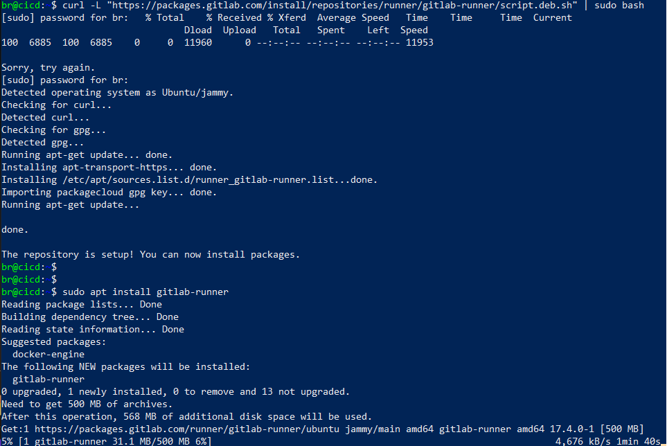
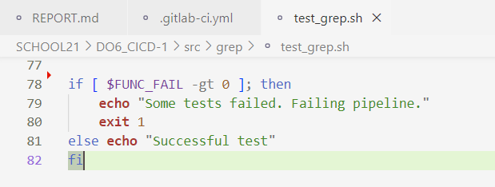

## Part 1. Настройка gitlab-runner

Настройка подключения по ssh к vm

* включаем проброс портов, в настройках vm virtual box


> sudo nano /etc/ssh/sshd_config

* открываем порт 22


* перезагружаем ssh
> systemctl restart ssh

* проверяем статус ssh


* подключаемся по shh через power shell


* генерируем ssh для gitlab


* добавляем ключ в gitlab

* cкачан и установлен на виртуальную машину gitlab-runner

> curl -L "https://packages.gitlab.com/install/repositories/runner/gitlab-runner/script.deb.sh" | bash

> apt-get install gitlab-runner
  

* Запуск gitlab-runner и регистрация его для использования в текущем проекте

> gitlab-runner register


## Part 2. Сборка

* создаем конфигурационный файл для настройки CI/CD в GitLab
> touch .gitlab-ci.yml

В файл gitlab-ci.yml добавлен этап запуска сборки через мейк файл из проекта C3. Файлы, полученные после сборки (артефакты), сохраняются в произвольную директорию со сроком хранения 30 дней.

* Содержание файл gitlab-ci.yml 


* установка make в виртуальную машину
> sudo apt update
> sudo apt install build-essential


* проверка установлен ли make
> make --version

* перезагружаем gitlab-runner
> sudo gitlab-runner restart

* пуш проекта в gitlab
> git add ../.gitlab-ci.yml
> git commit -m "исправила теги в yml"
> git push origin develop

* задача в CI/CD gitlab


* артефакты после выполнения задачи


# Part 3. Тест кодстайла

* устанавливаем пакет clang-format на машину с ранером

> sudo apt install clang-format

* проверка установлен ли clang-format

> clang-format --version

* добавляем дополнительный этап (style) пайплайна


* пуш проекта в gitlab
> git add ../.gitlab-ci.yml
> git commit -m "part 3, обновленный yml"
> git push origin develop

* задача в CI/CD gitlab


* выполненный этап style


# Part 4. Интеграционные тесты

* устанавливаем пакет valgrind на машину с ранером
> sudo apt-get install valgrind

* проверка установлен ли valgrind
> valgrind --version

* исправлен тестовый файл, добавлен выход с ошибкой при наличие fail



* добавляем дополнительный этап (tests) пайплайна


* задача в CI/CD gitlab


* выполненный этап tests


* чуть изменяем тест для fail


* теперь fail вызывает код ошибки


<details>
    <summary>Другой вариант решения через log file</summary>
    script:
    - cd src/cat
    - make test | tee test_output.log  # Запускаем тесты и сохраняем вывод в лог
    - make test
    - cd ../grep
    - make test | tee -a test_output.log  # Добавляем вывод тестов в тот же лог
    - |
      if grep -q "FAIL: 0" test_output.log; then
        echo "All tests passed."
      else
        echo "Tests failed!"
        exit 1
      fi
    - make test
</details>

# Part 5. Этап деплоя

* создаем вторую машину cicd2

* меняем сеть на сетевой мост


* меняем пользователя на gitlab-runner
> sudo su gitlab-runner


* генерируем ssh ключ
> ssh-keygen -t rsa -b 4096 -C "gitlab-runner@cicd-system"


* копируем ssh на машину 2
> ssh-copy-id br2@192.168.1.24


* добавляем дополнительный этап (deploy_job) пайплайна


* script_deploy.sh


* делаем владельцем /usr/local/bin br2 на 2 машине 
> sudo chown -R root /usr/local/bin

* выполненный этап deploy_job


* проверяем файлы на машине 2 


# Part 6. Дополнительно. Уведомления

* создаем бота через бота в тг BotFather


* узнаем id написав в бот сообщения и перейбя в браузере по ссылке со своим токеном

> https://api.telegram.org/botYOUR_TOKEN/getUpdates

* создаем файл notify.sh


* дописываем в yml 

```console
after_script:
    - bash src/notify.sh
```

* пушим и смотрим уведомления в тг

